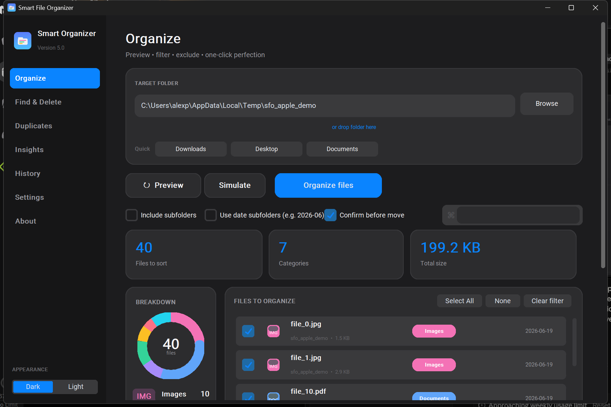
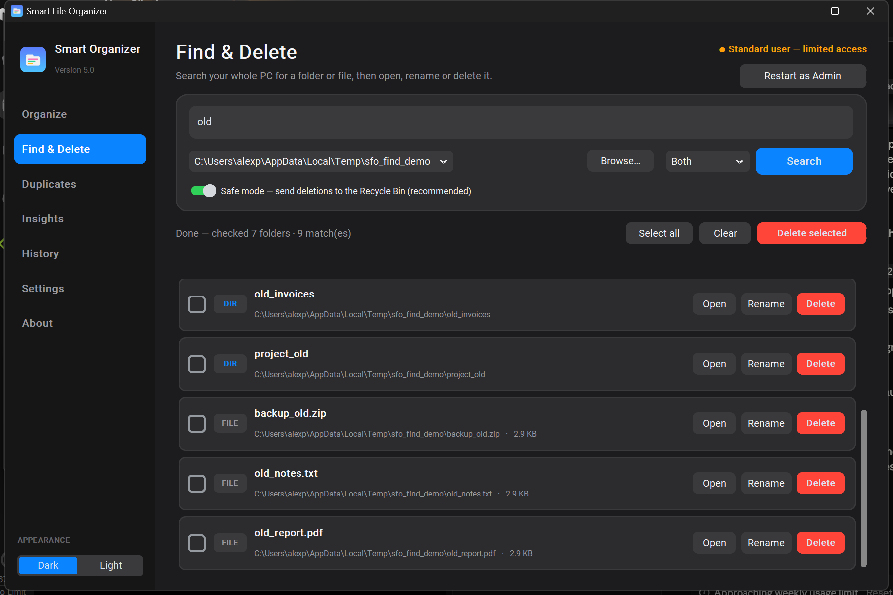

<div align="center">


# FileFlow

**A simple but powerful local file organizer for Windows.**

It helps you keep your Downloads and other folders tidy by automatically sorting files into categories like Images, Documents, Videos, etc. It has a nice interface, live auto-organize, background tray mode, and even a full-PC search tool to find and delete junk safely.




</div>

---

## Features

- Clean interface for previewing and organizing files
- Smart automatic categorization (with support for Slovak/English patterns)
- Live Auto mode that watches folders and organizes new files in the background
- System tray support so it can run without taking up screen space
- Command palette (Ctrl+K) for quick actions
- Find & Delete tool to search your entire PC and safely remove files
- Duplicate finder (exact matches + similar images)
- Undo support, custom rules, profiles, dry-run mode, and Windows context menu integration

Runs as a single portable .exe file — no installation or Python needed.

## 🔎 Find & Delete — search & clean your whole PC

<div align="center">

</div>

Type a name, pick a scope (**All drives**, a single drive, or **Browse…** to a
folder), choose **Folders / Files / Both**, and hit **Search**. Results stream in
live with the full path and size — each row has **Open**, **Rename** and
**Delete**, plus multi-select **Delete selected**.

**Built to be safe:**

- **Recycle Bin by default** — "Safe mode" sends deletions to the Recycle Bin so
  they're recoverable. Permanent delete is an explicit opt-in (with a warning).
- **Protected paths are blocked** — Windows, Program Files, ProgramData, drive
  roots and whole user profiles can never be deleted, *even as admin*.
- **Admin only when you ask** — click **Restart as Admin** to elevate via UAC and
  reach protected locations; otherwise it runs with normal user rights.

## How it works

1. Point it at a folder (Downloads is the default).
2. Preview the files — you can search, filter by category, deselect things you want to skip, or change categories for individual files.
3. Hit Organize (or use the command palette with Ctrl+K).
4. Enable Live Auto if you want it to watch the folder and sort new files automatically.
5. You can close the window — it will keep running from the system tray.
6. Use History to undo if needed.

A folder full of `photo.jpg`, `invoice.pdf`, `setup.exe`, `song.mp3` becomes:

```
Downloads/
├── Images/      photo.jpg
├── Documents/   invoice.pdf
├── Programs/    setup.exe
└── Music/       song.mp3
```

---

## Using FileFlow

1. Run the `FileFlow.exe` (it's portable, nothing to install).
2. Select the folder you want to organize.
3. Click Preview to see what it found.
4. Review and adjust as needed.
5. Click Organize.

It is designed to be easy to use and safe. All moves can be undone from History. Find & Delete has protections so you won't accidentally delete important system files.

---

## For developers

To run from source:

```powershell
pip install -r requirements.txt
python organizer.py
```

To build the exe:

```powershell
python -m PyInstaller FileFlow.spec
```

## Customizing

You can modify the categories and rules directly in the source code.

## License

This project is open source under the GPL-3.0 license.

GitHub: https://github.com/Apoliak7777/FileFlow

<div align="center">
FileFlow
</div>
